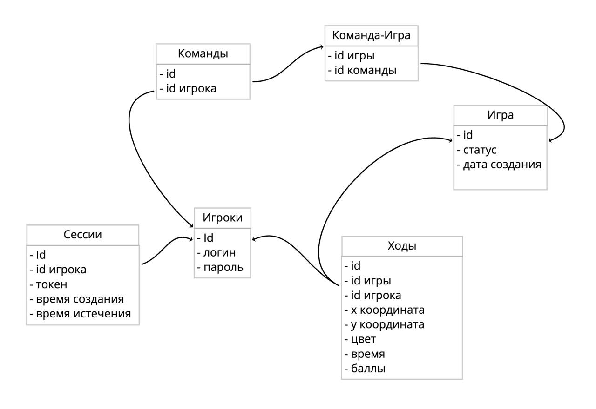

# Пиксель Баттл

Разработка творческо-игрового приложение Pixel battle, среди аналогов которого можно отметить Reddit r/Place, Pixel Canvas. В приложении пользователи могут раскрашивать пиксели, создавая рисунки, тем самым соревнуясь и захватывая большую часть игрового полотна.

### Описание
Разрабатываемое приложение должно быть масштабируемы и быстрым. Начальная версия (MVP) включает базовый функционал:
- Создание пользователя
- Создание игрового поля
- Рисовка пикселей
- Выбор цвета
- Очистка пикселей
- Отображение таймера
- Подсчет баллов

Обработка запроса от пользователя и отрисовка пикселя должны производиться не более чем за 100 мс. Реализуется базовая регистраци. Приложение строится с использованием принципов ООП и клиент-серверной архитектуры.

### Функциональные требования

- Сделать ход:
Можно покрасить пиксель 1 раз в 1 минуту или 2 раза в 2.10 секунд;
Пользователь может выбрать цвет и покрасить пиксель;
Пользователь может очистить пиксель;

- Начисление очков
За каждый захваченный пиксель, пользователю (команде) начисляется 5 баллов.

- Работа таймера:
После раскраски пикселя, таймер обновляется, в зависимости от того, 2 или 1 пиксель были раскрашены. 

- Формат: 
Игра должна быть многопользовательской, должна происходить синхронизация поля у всех игроков в реальном времени.

### Нефункциональные требования
- Производительность:
Время отклика API не должно превышать 10 мс.
- Безопасность:
Реализовать аутентификацию пользователей (например, посредством JWT или сессионной аутентификации).
- Поддерживаемость:
Использование ООП и принципов SOLID.
Клиент-серверная архитектура.
База данных, в которой хранятся данные. 
Использование системы для миграции данных .
Документированный API (Swagger/OpenAPI).

### Архитектура системы
- Структура приложения
Приложение разделено на следующие слои:
Клиент: отправляет wb запросы  на сервер.
Сервер: реализует авторизацию, бизнес-логику и работу с бд.

- Используемые технологии
Клиентская часть: HTML5/CSS/JavaScript.  
Серверная часть: Scala,  Akka HTTP или Play Framework, WebSockets.
База данных: PostgreSQL.
Документация API: Swagger или OpenAPI.
Система сборки: Sbt.
Система миграций: Flyway.

- Диаграммы сущностей

### План тестирования и обеспечения качества
- Unit‑тестирование: Тестирование отдельных компонентов ScalaTest.

- Интеграционное тестирование:
Проверка взаимодействия между слоями (контроллер, сервис, репозиторий) и корректной работы API.

- API‑тестирование:
Тестирование эндпоинтов с помощью Postman или аналогичных инструментов. 

### Развертывание и CI/CD
Система сборки: Sbt.\
Контроль версий: Git‑репозиторий.\
CI/CD: под вопросом.\
Контейнеризация: развертывание приложения в Docker‑контейнере для упрощения развертывания и масштабирования.

### Оценка рисков
- Невозможность обеспечения заявленной производительности при высоких нагрузках.
- Возможно, долгая отрисовка "пикселей".
- Разрешение проблемы конкурентного доступа к пикселям.

Как можно предусмотреть:
Для MVP выбираем правильный стек технологий для специфики данной задачи и грамотно продумываем бизнес-логику.  

Заключение:
В итоге должно быть реализовано описанное MVP.
